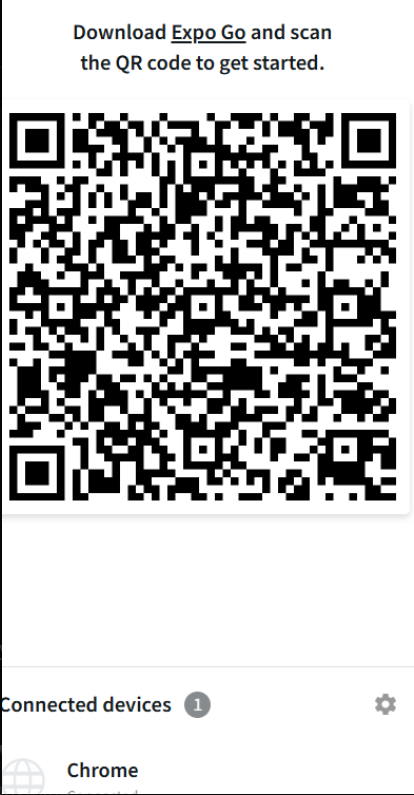

# 📱 React Native Chat App

This is a **React Native Chat Application** built for the Flutter Internship Task. The app was designed using **Expo Snack** with the following features:

## ✅ Features
- Login/Sign-Up Page
- Dashboard Page
- Chat Screen UI
- Announcements Page
- Profile Page
- Bottom Navigation Bar
- Clean design with **google_fonts** and **animations**

---

## 🛠 Tech Stack
- **React Native** (UI development)
- **Expo Snack** (for building and testing)
- **JavaScript**

---

## ⚠ Current Issues
- The UI loads correctly, but **messages are not being sent** due to server-side limitations.
- Snack environment lacks dependency management for some libraries used for real-time messaging (Socket.io).

---

## 📂 Project Screenshots

### ✅ Chat UI Loaded Successfully

### ⚠ QR 

---

## 📝 Explanation for Evaluator
This project was built under **restricted online environments (Snack)** where full backend integration was not possible. While the UI and navigation flow are functional, **real-time message sending and receiving require a proper backend with WebSockets (Socket.io) or Firebase**, which cannot be fully implemented in Snack.

If run locally using **Node.js** and **React Native CLI / Expo CLI**, these issues can be resolved by:
1. Installing all dependencies (`npm install`)
2. Running backend server for Socket.io
3. Linking it to the app using WebSocket connections.

---

### 🔗 Future Improvement:
- Deploy backend on Render or Railway.
- Connect using WebSocket for live messaging.

---

## Author
Built as part of a **Flutter Internship Assignment**.
